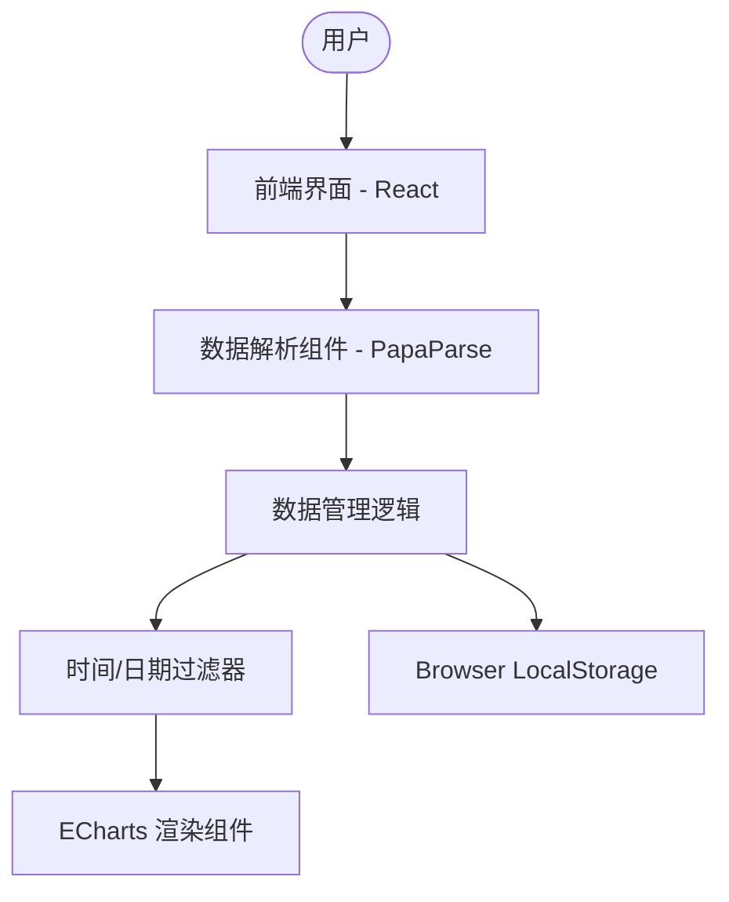
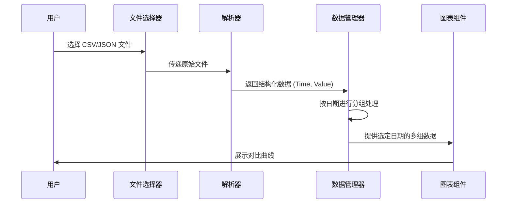
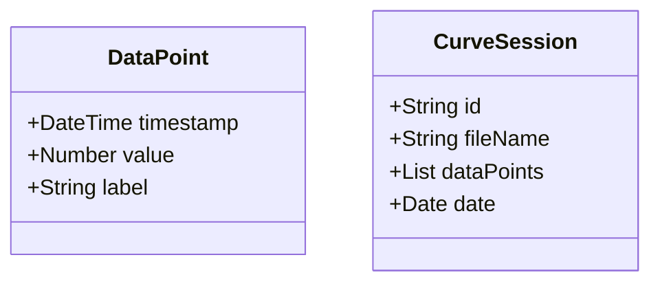

# 项目规范文档 (spec.md) - 数据曲线分析系统 (DataCurve Analysis System)

## 1. 项目概述

本项目是一个基于 Web 的数据可视化工具，旨在帮助用户导入包含时间信息和数值的数据，并以曲线图的形式展示。用户可以方便地对比同一天内不同时段或不同数据源的曲线，进行深入分析。

## 2. 技术选型 (必须)

- **前端框架**: React (Vite 驱动)
- **图表库**: Apache ECharts (功能强大，支持多曲线对比和大数据量渲染)
- **数据解析**: PapaParse (CSV 解析)
- **样式方案**: Vanilla CSS + CSS Modules / Glassmorphism 设计风格
- **版本控制**: Git (GitHub)

## 3. 可行性评估 (必须)

- **技术可行性**: 现代浏览器完全支持 CSV/JSON 文件的本地读取和解析。ECharts 能够流畅处理数万个点的曲线实时渲染。
- **环境支持**: macOS 环境下 Node.js/Vite 构建链成熟。
- **风险点**: 大文件解析可能导致 UI 卡顿，需采用 Web Worker 或流式解析（后期优化）。目前初始版本采用常规解析。

## 4. 架构与流程图

### 4.1 系统构架 (必须)

### 4.2 关键流程 (必须)

### 4.3 资料模型 (必须)

## 5. 功能模块

1. 数据导入: 支持拖拽或选择文件上传。
2. 数据清洗与解析: 自动识别日期格式和数值。
3. 曲线展示:
   - 多曲线叠加。
   - 缩放、漫游交互。
   - 悬浮查看具体数值。
4. 对比分析: 允许用户挑选同一天的多条历史曲线进行重叠对比。

## 6. 任务进度

- [x] 项目初始化 & Spec 定义
- [x] 基础框架搭建 (Vite + React)
- [x] 文件解析功能实现
- [x] ECharts 基础曲线渲染
- [x] 同一日期多曲线对比逻辑实现
- [x] UI 高级美化 (Glassmorphism)
- [x] 部署准备与文档完成 (NAS)
- [x] VPS 部署环境配置与脚本编写 (107.174.62.30)
- [ ] 导出数据维度分列优化
- [ ] 坐标轴负数自适应与调整逻辑优化
- [ ] 历史存单批量管理功能

